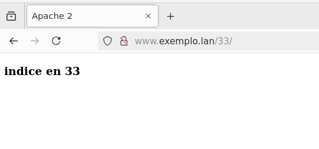

## Solucion tarefa 4.1 - Host Virtuais con Apache. Directorios

Necesitamos ter un nome DNS válido que apunte ao enderezo IP da nosa máquina.  Nesta tarefa, supoñemos que o nome do dominio é equipo.lan, pero necesitarás adaptar ao teu nome DNS.

Configuramos un servidor virtual para www.exemplo.lan (e que tamén responda para exemplo.lan e eq1.exemplo.lan). monta o directorio exemplo.lan en  en /opt/web/exemplo.lan

Se empregas a máquina virtual de Google Cloud, elixte ti dous dos nomes que teñas ti configurado nun dos teus dominios.

A configuración para o sitio www.exemplo.lan debe ser a seguinte:

- O raíz de documentos debe ser /opt/web/exemplo.lan/htdocs. A orde de ficheiros de procura debe ser inicio.html, indice.html e primeiro.html por esta orde. Tendo en conta os ficheiros que hai no directorio raíz, indica que ficheiro se amosa accedendo a http://www.exemplo.lan/, http://www.exemplo.lan/11 e http://www.exemplo.lan/22 explicándoo brevemente, e pegando unha captura de pantalla desde o navegador dun cliente.

    - http://www.exemplo.lan/

        

    - http://www.exemplo.lan/11

        

    - http://www.exemplo.lan/22

        

- No host virtual queremos facer que se habiliten as inclusións desde o servidor e se sigan as ligazóns simbólicas. Para probalo, crea unha ligazón simbólica chamado “zz” ao directorio 33 (ámbolos dous dentro do directorio raíz de documentos). Ademais, queremos facer que no directorio 33 a orde de ficheiros de atopar cando se introduce na URL o nome dun directorio, sexa indice.html, inicio.html e primeiro.html. Amosa a configuración establecida e indica razoadamente que ficheiro se debería amosar accedendo a http://www.exemplo.lan/zz e http://www.exemplo.lan/33. Amosa unha captura de pantalla de cada un para demostralo.

    - http://www.exemplo.lan/zz

        

    - http://www.exemplo.lan/33

        

- No directorio 33 (dentro do raíz de documentos) queremos engadir a opción para amosar un listado do contido do directorio no caso de se introduza un directorio na URL e que non exista ningún dos ficheiros especificados anteriormente como de procura e tamén deshabilitar a opción de facer ligazóns simbólicas. Crea unha ligazón simbólica dentro dese directorio chamado yy con destino a 44 (dentro do raíz de documentos). Indica a configuración establecida, engade unha captura de pantalla e explica a saída producida para http://www.exemplo.lan/33/yy http://www.exemplo.lan/33/imaxes , http://www.exemplo.lan/44 e http://www.exemplo.lan/22

    - http://www.exemplo.lan/33/yy

        

    - http://www.exemplo.lan/33/imaxes

        

    - http://www.exemplo.lan/44

        

    - http://www.exemplo.lan/22

        

- Indica como farías, sen alterar o sistema de ficheiros, para que cando accedamos a http://www.exemplo.lan/datos se acceda ao contido que exista dentro de /opt/web/exemplo.lan/datos. Amosa tamén unta captura de pantalla da URL anterior.

    - Habería que configurar un htaccess de xeito que, ao abrir o navegador e colar a URL aparecese o index.html de [./exemplo.lan/datos](exemplo.lan/datos/inicio.html)

    

- No directorio 50 (dentro da raíz de documentos), tamén queremos habilitar o traballo con ficheiros .htaccess, pero so queremos habilitar as opcións mínimas necesarias para facer o seguinte dentro dese directorio:

    - A orde de ficheiros a buscar debe ser un.html, dous.html e tres.html nesa orde, e no subdirectorio abc que está dentro de 50 a orde será tres.html, dous.html e un.html

    

    - No subdirectorio segredo non está permitido o acceso.

    

    - No subdirectorio imaxes queremos habilitar a opción para que cando non existan os ficheiros de procura se amose un listado co contido do directorio.

    

    - No caso de que se poña unha directiva non permitida, trataranse as directivas non permitidas coma non fatais

- Indica os cambios que habería que facer para non ter que poñer de forma explícita unha sección <Directory> para o mesmo directorio indicado pola directiva DocumentRoot, se todos os host virtuais estivesen aloxados dentro de /opt/web

    

- No mesmo suposto que esta tarefa, que pasaría se a directiva DirectoryIndex estivese dentro do directorio indicado coa directiva DocumentRoot?
    
    Neste caso, Apache usará a orde de ficheiros especificada pola directiva DirectoryIndex cando o cliente acceda a un directorio. Isto significa que se o cliente accede a http://www.exemplo.lan/:
    - Apache buscará primeiro inicio.html.
    - Se non existe, buscará indice.html.
    - Se tampouco existe, buscará primeiro.html.
    - Se ningún destes ficheiros está dispoñible, Apache mostrará un erro HTTP 403 (prohibido) ou 404 (non atopado), dependendo da configuración.
    
    Isto afecta a todos os directorios dentro do DocumentRoot, a non ser que se sobreecriba con arquivos .htaccess ou bloques Directory.

- Que pasa se poñemos un ficheiro .htaccess no directorio do DocumentRoot?

    1. O ficheiro .htaccess permite configurar directivas específicas para o directorio no que está situado e para os seus subdirectorios. As configuracións que poñamos nese ficheiro afectarán a todo o contido servido desde ese DocumentRoot, pero só se AllowOverride está configurado para permitir o uso de .htacess.

    2. O comportamento do .htaccess depende de como estea configurado o Apache no arquivo principal (como tarefa1.conf). A directiva AllowOverride dentro dun bloque Directory define o que pode facerse nun .htaccess.

    3. Se un cliente accede a http://www.exemplo.lan/ sen .htaccess, Apache segue a configuración global ou a configuración no bloque Directory

- Que pasaría se no directorio 50 non existisen os ficheiros un.html, dous.html e tres.html?

    O comportamento de apache dependerá da configuración establecida no ficheiro .htaccess. As posibilidades son:

    - Se Options +Indexes está habilitado: Apache mostrará un listado do contido do directorio.
    - Se Options -Indexes está configurado. apache retornará un erro 403 Forbidden.
    - Se hai un ficheiro .htaccess coas directivas adecuadas: o servidor pode devolver un erro 404 Not Found e redirixir ao ficheiro error404.html

- Que pasaría se nun ficheiro .htaccess no directorio 50 se introduce unha directiva non permitida, coma por exemplo ErrorDocument?.

    - Se AllowOverride permite esa directiva: ErrorDocument será procesado adecuadamente.
    - Se AllowOverride non permite esa directiva: ErrorDocument non está permitido, porque AllowOverride só habilita Indexes.

- Como farías para configurar os 4 primeiros puntos con ficheiros .htaccess. Amosa a configuración resultante do host virtual, e o contido e localización dos ficheiros `.htaccess`

    - Configuración resultante de tarefa1.conf

        

    - Configuración do .htaccess para o DocumentRoot. Localización: /opt/web/exemplo.lan/htdocs/.htaccess

        

    - Configuración do .htaccess no directorio 33. Localización: /opt/web/exemplo.lan/htdocs/33/.htaccess

        

    - Configuración para acceso a /dados sen alterar o sistema de ficheiros. Localización: /opt/web/exemplo.lan/htdocs/.htaccess

        

    - Configuración para o directorio 50: /opt/web/exemplo.lan/htdocs/50/.htaccess

        